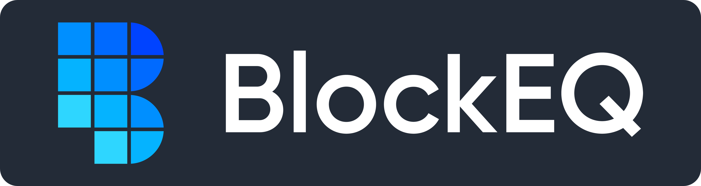

  

  

# BlockEQ iOS Wallet

## Project Status

## Table of Contents
- [Introduction](#introduction)
- [Features](#features)
- [Feedback](#feedback)
- [Contributors](#contributors)
- [Development](#development)
  - [Getting Started](#getting-started)
  - [Building the Project](#building-the-project)

## Introduction
BlockEQ is a private Stellar wallet that allows you to easily create or access an account with a recovery phrase. With BlockEQ you can send, receive, and trade XLM and Stellar tokens on the SDEX, Stellar’s decentralized exchange.

  

## Features

A few of the main things the wallet supports:

* Add & remove Stellar Tokens
* Join an inflation pools
* SDEX Trading
* QR code address display and scanning
* Use memo field for sending to exchanges
* Create a new wallet with a 24 word recovery phrase
* Recover your wallet with a 12 or 24 word mnemonic phrase
* Exchange address recognition (Memo Required)
* Change PIN Settings (Toggle on/off for opening app or sending)

## Feedback

If you need help with code, open up a [new question on Stack Overflow](https://stackoverflow.com/tags/blockeq-ios), using the tag `blockeq-ios`, along with `swift`, `xcode`, and other appropriate tags that will give your question the most visibilty.

Feel free to send us feedback on [Twitter](https://twitter.com/block_eq) or [file an issue](https://github.com/block-equity/stellar-ios-wallet/issues/new). 

Feature requests are always welcome. If you wish to contribute, please take a quick look at the [guidelines](./CONTRIBUTING.md)!

If you just want to hang out and chat about BlockEQ, please feel free to join our [Slack Channel](https://blockeq.slack.com)!

## Development
Please take a look at the [contributing guidelines](./CONTRIBUTING.md) for a detailed process on how to build your application as well as troubleshooting information.

### Getting Started
* Install [swiftlint](https://github.com/realm/SwiftLint)
* Install [cocoapods](https://cocoapods.org)
* Install the [latest version of Xcode](https://developer.apple.com)

### Building the Project
1. Clone the repository
2. Navigate to the project root
3. Run `pod install`
4. Open "BlockEQ.xcworkspace"
5. Select a simulator to build with, like `iPhone XS`
6. Press `⌘-R`, the application should launch in the simulator.

If the above steps completed successfully, you're ready to begin developing! Otherwise, check out he troubleshooting section below.

### Troubleshooting

#### Build Errors
These are difficult to predict ahead of time, but general build error fixes include:
* Peforming a clean build
* Re-running `pod install`
* Verifying you have the correct Xcode tools selected: `Preferences > Locations > Command Line Tools`

If you still are having issues, an upstream dependency may have caused build errors, or there might be something specific to your environment. Feel free to open an issue if you find yourself in this situation.